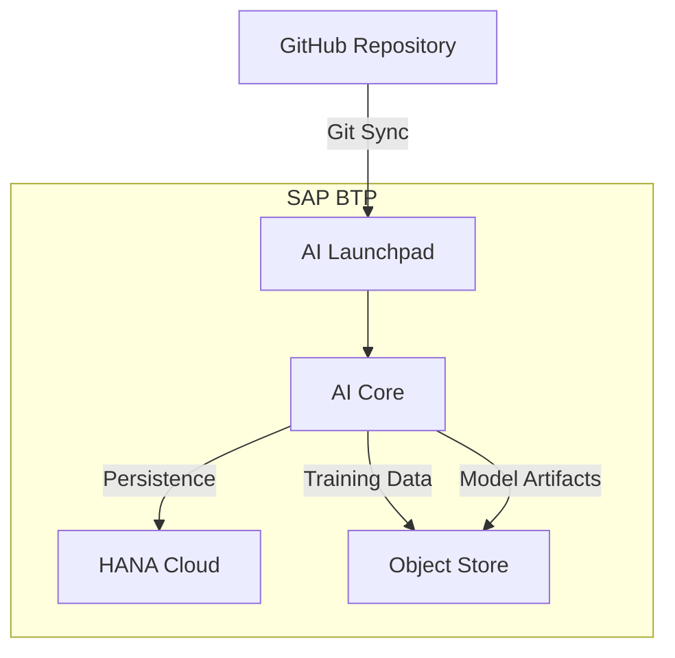

# SAP AI Journey

SAP AI Core workflows and CAP applications for ML pipelines, model serving, and AI integration on SAP BTP.

## Labs

| Lab | Type | Description |
|-----|------|-------------|
| [hello-world-pipeline](./hello-world-pipeline/) | AI Core Workflow | Basic workflow introduction |
| [hello-metrics-pipeline](./hello-metrics-pipeline/) | AI Core Workflow | Metrics tracking |
| [ml-training-pipeline](./ml-training-pipeline/) | AI Core Workflow | ML training pipeline |
| [model-serving](./model-serving/) | AI Core Serving | Model deployment |
| [multi-step-pipeline](./multi-step-pipeline/) | AI Core Workflow | Multi-step orchestration |
| [mlops](./mlops/) | AI Core MLOps | MLOps patterns |
| [btp-ops-intelligence](./btp-ops-intelligence/) | CAP Application | Operations dashboard |
| [payment-risk](./payment-risk/) | CAP + RPT-1 | Payment risk prediction |

## Architecture



## Prerequisites

- SAP BTP subaccount with AI Core entitlement
- SAP AI Launchpad access
- Docker for workflow image builds
- Python 3.11+

## Git Sync Setup

1. Connect repository to AI Core via AI Launchpad > Applications > Create
2. Workflows appear in ML Operations > Workflows
3. Create configurations and executions

## Quick Start

```bash
git clone https://github.com/srini118us/sap-ai-journey.git
cd sap-ai-journey

# CAP applications
cd btp-ops-intelligence && npm install && cds watch

# AI Core workflows - push to GitHub, sync via AI Launchpad
```

## References

- [SAP AI Core](https://help.sap.com/docs/sap-ai-core)
- [SAP AI Launchpad](https://help.sap.com/docs/ai-launchpad)
- [SAP CAP](https://cap.cloud.sap/docs)
- [SAP BTP Icons](https://sap.github.io/btp-solution-diagrams/)
