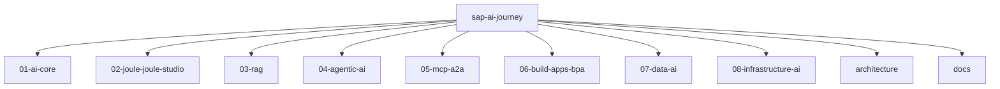

# SAP AI Journey

A collection of hands on SAP AI labs covering SAP AI Core, Generative AI Hub, Joule and Joule Studio, RAG, Agentic AI, MCP and A2A, SAP Build, data and AI integration, and AI assisted SAP infrastructure and operations.

This repository focuses on individual SAP AI capabilities, reusable patterns, and focused technology labs. Larger business solutions that combine application, data, AI, integration, and decision layers are maintained separately under End to End Labs.

All work runs on personal lab, trial, and sandbox environments. Maturity is noted per lab in each section README.

## Structure

```mermaid
flowchart TD
    R[sap-ai-journey]
    R --> A[01-ai-core]
    R --> B[02-joule-joule-studio]
    R --> C[03-rag]
    R --> D[04-agentic-ai]
    R --> E[05-mcp-a2a]
    R --> F[06-build-apps-bpa]
    R --> G[07-data-ai]
    R --> H[08-infrastructure-ai]
    R --> I[architecture]
    R --> J[docs]
```

| Folder | What belongs here |
|---|---|
| [01-ai-core](01-ai-core/) | SAP AI Core runtime, training, serving, metrics, utilities, and RPT 1 |
| [02-joule-joule-studio](02-joule-joule-studio/) | Joule Studio agents and skills |
| [03-rag](03-rag/) | Retrieval augmented generation on SAP data (HANA vector engine, GenAI Hub) |
| [04-agentic-ai](04-agentic-ai/) | Agent orchestration and agent architecture labs |
| [05-mcp-a2a](05-mcp-a2a/) | MCP servers and agent interoperability |
| [06-build-apps-bpa](06-build-apps-bpa/) | SAP Build apps and process automation, CAP apps |
| [07-data-ai](07-data-ai/) | SAP data plus AI experiments (BDC Delta Share on Databricks, HANA Cloud ML) |
| [08-infrastructure-ai](08-infrastructure-ai/) | AI assisted SAP Basis and operations (Basis Copilot, patching, diagnostics, BTP ops) |
| [architecture](architecture/) | Cross lab architecture notes |
| [docs](docs/) | Supporting documentation and the old to new path mapping |

Two staging folders hold items waiting for a decision:

* `_e2e-candidates/`: complete business solutions (Email to Order, Invoice copilot) that fit the planned End to End Labs repository.
* `_pending-learning/`: generic framework exercises (Claude API sessions, n8n triage) that fit the planned learning repository.

## Featured labs

* Basis Copilot: Google ADK and Gemini agent for SAP Basis operations ([08-infrastructure-ai](08-infrastructure-ai/basis-copilot/))
* Joule Studio 2 Intelligent Collections Orchestrator ([02-joule-joule-studio](02-joule-joule-studio/collections-orchestrator/))
* Cashflow forecasting pipeline on SAP AI Core ([01-ai-core](01-ai-core/cashflow-forecast/))
* MCP servers for S/4HANA, cashflow, and procurement ([05-mcp-a2a](05-mcp-a2a/))
* Vendor master data quality RAG ([03-rag](03-rag/vendor-mdq-copilot/))
* BDC Delta Share ML labs on Databricks ([07-data-ai](07-data-ai/databricks-labs/))

## Related repositories

Databricks, SAP Datasphere and BDC, Google Vertex AI, and AWS Bedrock work are maintained in separate repositories under github.com/srini118us.
