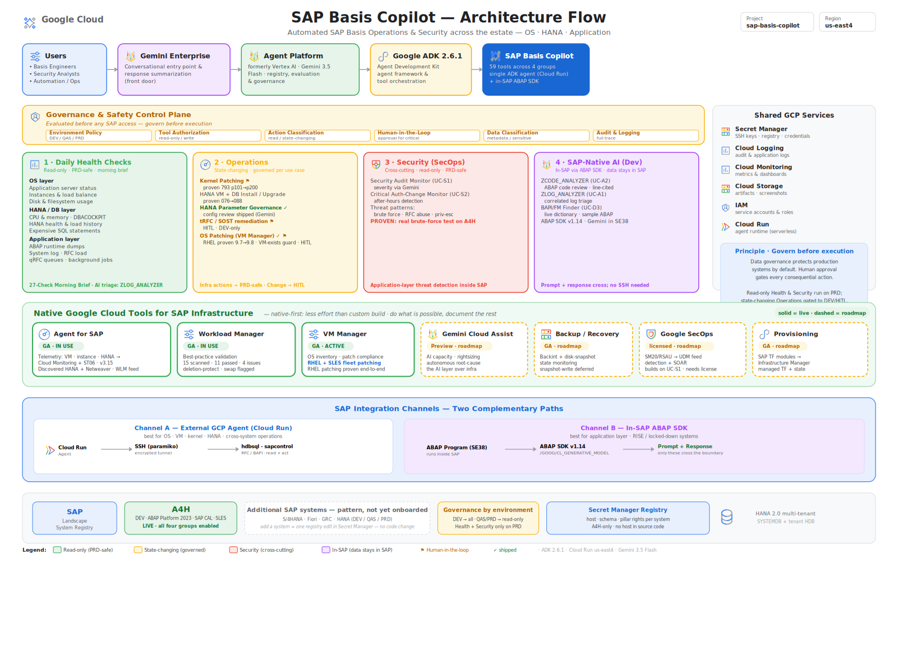

# SAP Basis Copilot

An agentic AI assistant built with Google ADK and Gemini that automates SAP Basis operations against SAP systems — daily health checks, security monitoring, kernel and OS patching, HANA configuration governance, and human-in-the-loop queue and IDoc reprocessing. It runs as a single ADK agent orchestrating 59 tools, deployed on Cloud Run and callable from a browser chat interface.

> Lab and prototype implementations against a trial SAP landscape. Host identifiers in this repository are placeholders; real hosts, credentials, and keys are pulled from Secret Manager at runtime and are never committed.

## Architecture

Browser (Cloud Run web UI) → Google ADK agent (Gemini via Vertex AI) → two channels into SAP:

- **SSH (paramiko) + hdbsql + sapcontrol** to the SAP host (HANA + ABAP stack) for OS/DB/instance operations
- **ABAP SDK for Google Cloud** for in-SAP use cases that run under SAP's own authorization

For infrastructure operations, the agent also calls **Google Cloud APIs directly** through the Python client libraries (VM Manager / OS Config, Compute) using the Cloud Run service account.

Deployed on Cloud Run: containerized (Dockerfile), secrets pulled from Secret Manager at runtime (SSH keys and the system registry are never baked into the image).

## What it does

The tools are organized into four functional groups, spanning a multi-system registry (a live trial system plus fictional demo SIDs for DEV/QAS/PRD governance).

### Daily health checks

A Basis engineer's morning routine, automated: instance and process health (SM51/SM50), HANA process health, disk space, long-running and PRIV-mode work processes (SM66), DBACOCKPIT load history and expensive SQL, update and lock monitoring (SM13/SM12), queue and email status (SM58/SOST), kernel version, and job monitoring (SM37 cancelled and long-running jobs) — plus Gemini Vision analysis of DBACOCKPIT CPU and memory charts.

### Operations

Kernel patching (a decomposed, safe sequence: scan → pre-checks → backup → stop SAP → apply → start SAP → post-checks → rollback), HANA parameter configuration governance (customer overrides reviewed for risk), ST22 dump triage, SM21 syslog analysis, and **OS patching via VM Manager** (see below).

### Security / SecOps

SM20 security audit log monitoring (brute-force and anomaly detection with an anti-hallucination guard), and critical authorization-change monitoring (AGR_USERS / USR02, flagging changes outside business hours).

### SAP-native AI (ABAP SDK)

Use cases that run inside the SAP application server under the ABAP SDK for Google Cloud — log analysis and ABAP code review — a different trust boundary from the SSH channel, and the pattern that works under RISE.

### OS patching via VM Manager (prompt-driven)

Patch the operating system of a target VM from a chat prompt. Four tools — `os_patch_check`, `os_patch_detect_app`, `os_patch_apply`, `os_patch_verify` — run the sequence through Google Cloud VM Manager: verify the VM exists and is running, read available updates, detect whether SAP/HANA is present, **pause for explicit human confirmation**, apply the patch job, confirm the reboot and report the OS version before → after, and verify 0 updates remain. Demonstrated end-to-end on RHEL (9.7 → 9.8); the SAP-safe stop/start orchestration for SAP hosts is on the roadmap.

### Human-in-the-loop reprocessing (tRFC / IDoc / SOST / workflow)

Finds failed entries, classifies each as transient (safe to retry) or a configuration issue (not safe to blindly retry), and refuses to auto-reprocess. It only executes on explicit user confirmation, with extra warnings for destinations that could touch invoicing, billing, or customer-facing interfaces.

## Native GCP tools (in use)

Alongside the custom tools, the agent operates on the SAP host using Google Cloud's native tooling: **Agent for SAP** (discovery and health), **Workload Manager** (SAP best-practice evaluation), and **VM Manager** (OS inventory and patch management, RHEL + SLES).

## Governance

Governance is by environment (DEV / QAS / PRD): each system in the registry declares which pillars are enabled, application-layer checks on non-DEV systems require approval, and state-changing operations (kernel patching, OS patching) are gated behind explicit in-chat confirmation. Role-based access control by persona (Basis / Security / OS) is on the roadmap.

## Known limitations and deferred work

- **SARFC (RFC resource monitoring):** the ABAP-layer equivalent (RSARFCCHK) needs a custom RFC-enabled function module or the ABAP SDK path. Scoped as future work.
- **DBACOCKPIT chart capture:** currently manual (screenshot + upload); SAP GUI Scripting automation was blocked by an RDP / COM window-station isolation issue. Deferred.
- **OS patch apply on very long jobs:** the tool waits up to ~20 minutes for completion; for larger fleets a non-blocking fire-and-check pattern is on the roadmap.
- **SAP-safe OS patch orchestration:** patch execution is demonstrated; the stop-SAP / start-SAP wrapper (with a pre-downtime session check) for SAP hosts is on the roadmap.

## Roadmap

- Safe-orchestration tool (OS + SAP kernel) with pre-downtime session check (active users, jobs, locks) and human-in-the-loop
- Role-based access control (RBAC) by persona
- Reusable email / notification tool called by several use cases to report status or completion — daily health checks, kernel patching, OS (VM) patching, HANA install (VM + DB), and HANA upgrade — via an approved mail relay (SMTP / Workspace API / SendGrid) with credentials in Secret Manager
- HANA parameter governance: drift detection and mini-checks
- Agent-to-Agent (A2A): a SAP agent (in-SAP) and an infrastructure agent (GCP) cooperating across the data-compliance boundary — the north star

## Stack

Google ADK, Gemini via Vertex AI (enterprise mode, global location), Cloud Run (containerized), Secret Manager (SSH keys, system registry), Cloud Storage, google-cloud-os-config and google-cloud-compute (VM Manager / Compute via the Python client), paramiko (SSH), hdbsql (HANA), sapcontrol (SAP process control), and the ABAP SDK for Google Cloud (in-SAP use cases).
