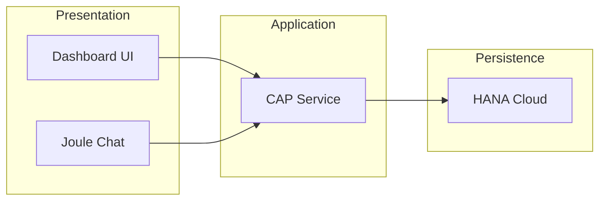

# BTP Ops Intelligence Dashboard

CAP-based operations dashboard exposing 9 OData endpoints for BTP landscape monitoring.

## Architecture



## OData Endpoints

| Endpoint | Description |
|----------|-------------|
| `/odata/v4/ops/SystemHealth` | System health status |
| `/odata/v4/ops/CostTrends` | Monthly cost data |
| `/odata/v4/ops/ActiveAlerts` | Current alerts |
| `/odata/v4/ops/UserActivity` | User metrics |
| `/odata/v4/ops/ServiceStatus` | Service availability |
| `/odata/v4/ops/Incidents` | Open incidents |
| `/odata/v4/ops/Deployments` | Recent deployments |
| `/odata/v4/ops/Compliance` | Compliance status |
| `/odata/v4/ops/Capacity` | Resource utilization |

## Project Structure

```
btp-ops-intelligence/
├── app/
│   └── dashboard.html
├── db/
│   └── schema.cds
├── srv/
│   ├── ops-service.cds
│   └── ops-service.js
├── package.json
└── mta.yaml
```

## Local Development

```bash
npm install
cds watch
```

Access: http://localhost:4004

## Cloud Foundry Deployment

```bash
mbt build
cf deploy mta_archives/btp-ops-intelligence_1.0.0.mtar
```

Note: HANA Cloud on trial auto-stops after idle period. Start via BTP Cockpit before demos.

## Joule Integration

Dashboard includes NL query widget supporting:
- System health queries
- Cost trend analysis
- Alert summaries

## References

- [SAP CAP](https://cap.cloud.sap/docs)
- [SAP HANA Cloud](https://help.sap.com/docs/hana-cloud)
