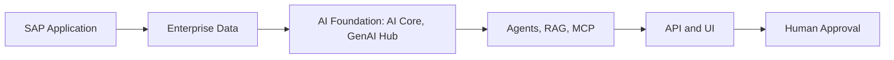

# Architecture

Cross lab architecture notes. Platform and layer view of the repository:

```mermaid
flowchart LR
    A[SAP Application] --> B[Enterprise Data]
    B --> C[AI Foundation: AI Core, GenAI Hub]
    C --> D[Agents, RAG, MCP]
    D --> E[API and UI]
    E --> F[Human Approval]
```

Complete multi layer solutions are staged in `_e2e-candidates/` for the End to End Labs repository.
