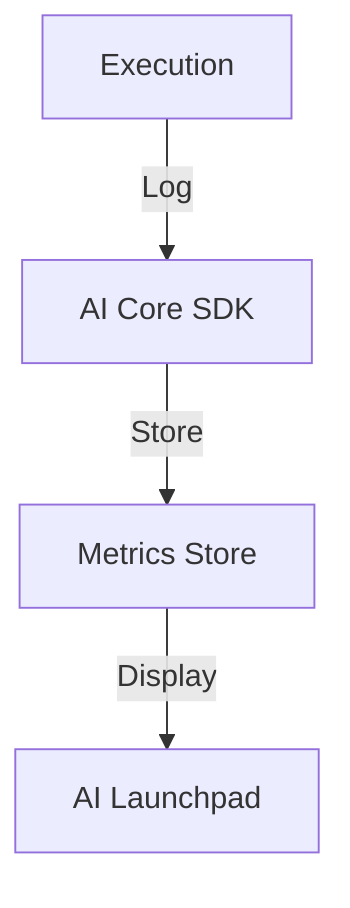

# Hello Metrics Pipeline

SAP AI Core workflow with metrics logging and tracking.

## Architecture



## Structure

```
hello-metrics-pipeline/
└── workflows/
    └── hello-metrics.yaml
```

## Metrics SDK Usage

```python
from ai_core_sdk.tracking import Tracking

tracking = Tracking()

tracking.log_metrics({
    "accuracy": 0.95,
    "loss": 0.05,
    "epoch": 10
})
```

## Metric Types

| Type | Example | Use Case |
|------|---------|----------|
| Scalar | `accuracy: 0.95` | Single values |
| Series | `loss: [0.5, 0.3]` | Training curves |
| Tags | `model: xgboost` | Metadata |

## Viewing Metrics

1. AI Launchpad > ML Operations > Executions
2. Select execution
3. Open Metrics tab
4. Compare across runs

## References

- [AI Core Metrics](https://help.sap.com/docs/sap-ai-core/sap-ai-core-service-guide/track-metrics)
- [AI Core SDK](https://pypi.org/project/ai-core-sdk/)
