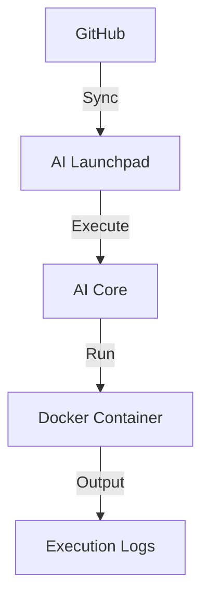

# Hello World Pipeline

Basic SAP AI Core workflow demonstrating pipeline fundamentals.

## Architecture



## Structure

```
hello-world-pipeline/
└── workflows/
    └── hello-world.yaml
```

## Workflow Definition

```yaml
apiVersion: argoproj.io/v1alpha1
kind: WorkflowTemplate
metadata:
  name: hello-world
spec:
  entrypoint: main
  templates:
    - name: main
      container:
        image: python:3.11-slim
        command: ["python", "-c"]
        args: ["print('Hello from SAP AI Core!')"]
```

## Execution

1. Push workflow to GitHub
2. Sync in AI Launchpad > Applications
3. Create Configuration
4. Create Execution
5. Monitor in Executions view

## Concepts

| Term | Description |
|------|-------------|
| WorkflowTemplate | Reusable workflow definition |
| Entrypoint | Starting template |
| Container | Docker image for execution |
| Configuration | Runtime parameters |
| Execution | Single run instance |

## References

- [AI Core Workflows](https://help.sap.com/docs/sap-ai-core/sap-ai-core-service-guide/create-workflow)
