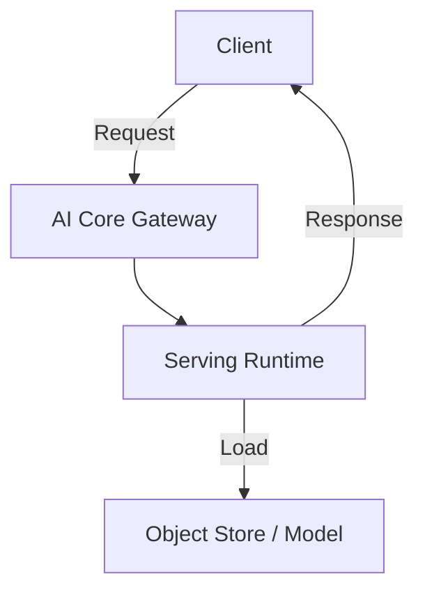

# Model Serving

Deploy and serve ML models on SAP AI Core with REST API endpoints.

## Architecture



## Structure

```
model-serving/
├── serve/
│   ├── Dockerfile
│   ├── app.py
│   └── requirements.txt
└── workflows/
    └── serving.yaml
```

## Serving Template

```yaml
apiVersion: ai.sap.com/v1alpha1
kind: ServingTemplate
metadata:
  name: model-server
spec:
  template:
    spec:
      containers:
        - name: server
          image: your-registry/model-server:latest
          ports:
            - containerPort: 8080
```

## Inference API

```bash
curl -X POST \
  https://api.ai.<region>.aws.ml.hana.ondemand.com/v2/inference/deployments/<id>/v1/predict \
  -H "Authorization: Bearer $TOKEN" \
  -H "Content-Type: application/json" \
  -d '{"features": [1.0, 2.0, 3.0]}'
```

Response:
```json
{
  "prediction": "HIGH",
  "confidence": 0.95
}
```

## Deployment

1. Build and push Docker image
2. Push serving template to GitHub
3. Sync to AI Launchpad
4. Create Configuration
5. Create Deployment
6. Get deployment URL

## Scaling Options

| Setting | Description |
|---------|-------------|
| `minReplicas` | Minimum instances |
| `maxReplicas` | Maximum instances |
| `resourcePlan` | CPU/memory allocation |

## References

- [AI Core Serving](https://help.sap.com/docs/sap-ai-core/sap-ai-core-service-guide/serve-model)
