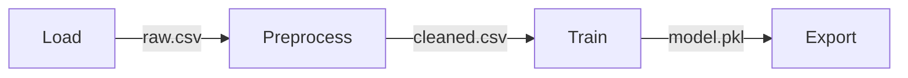

# Multi-Step Pipeline

Orchestrated SAP AI Core workflow with chained steps and artifact passing.

## Architecture



## Structure

```
multi-step-pipeline/
└── workflows/
    └── multi-step.yaml
```

## DAG Definition

```yaml
apiVersion: argoproj.io/v1alpha1
kind: WorkflowTemplate
metadata:
  name: multi-step-pipeline
spec:
  entrypoint: main
  templates:
    - name: main
      dag:
        tasks:
          - name: load-data
            template: load
          - name: preprocess
            template: preprocess
            dependencies: [load-data]
          - name: train
            template: train
            dependencies: [preprocess]
          - name: export
            template: export
            dependencies: [train]
```

## Artifact Passing

```yaml
- name: preprocess
  inputs:
    artifacts:
      - name: raw-data
        from: "{{tasks.load-data.outputs.artifacts.output}}"
  outputs:
    artifacts:
      - name: cleaned-data
        path: /tmp/cleaned.csv
```

## Parallel Execution

```yaml
dag:
  tasks:
    - name: train-rf
      template: train
      arguments:
        parameters: [{name: model, value: "random-forest"}]
    - name: train-xgb
      template: train
      arguments:
        parameters: [{name: model, value: "xgboost"}]
    - name: compare
      template: compare
      dependencies: [train-rf, train-xgb]
```

## Concepts

| Term | Description |
|------|-------------|
| DAG | Directed Acyclic Graph |
| Dependencies | Step ordering |
| Artifacts | Data between steps |

## References

- [Argo DAG Templates](https://argoproj.github.io/argo-workflows/dag/)
