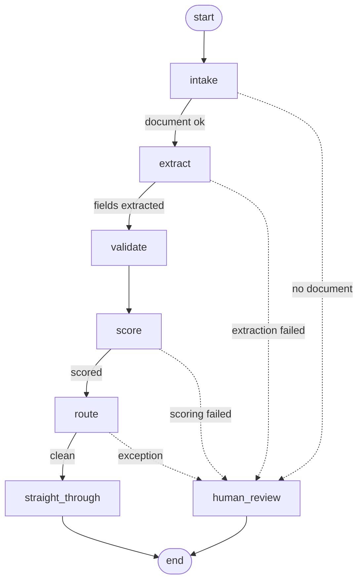

# invoice-copilot

A LangGraph agent that processes supplier invoices on SAP AI Core. It takes an
invoice document, extracts the fields with an LLM through SAP GenAI Hub,
validates them against live S/4HANA purchase-order data and against a second,
independently built extractor, risk-scores the result with SAP RPT-1.5 (a tabular prediction
model, not a chat model), and then routes: clean invoices go straight through,
anything questionable goes to a human. Every node
appends a decision and a reason to an audit trace carried on the state object,
including on the "nothing to flag" path, and no node raises — failures are
traced and routed, never swallowed and never fatal.

## Flow



Three branches short-circuit to `human_review`: there is nothing to extract
from without a document, nothing to validate or score without fields, and
nothing safe to route on without a risk band.

`docs/graph.png` is the same topology rendered from the compiled graph itself
(`docs/graph.mmd` is its Mermaid source). That pair is generated; the diagram
above is hand-written and can drift, so trust the PNG if they disagree.

## Nodes

| Node | Does | Status |
|---|---|---|
| `intake` | Normalizes raw input into `state["document"]`; rejects missing or blank text | Real except OCR |
| `extract` | Pulls invoice fields out of the document text with an LLM via GenAI Hub, then fetches a second reading from a Gemini agent on Cloud Run | Real |
| `validate` | Checks line items against the stated total, the fields against the live S/4HANA purchase order, and the two extractions against each other | Real |
| `score` | Risk-scores the invoice with SAP RPT-1.5 from a feature row | Real call, synthetic context rows |
| `route` | Decides straight-through vs exception from validation issues and risk band | Real |
| `straight_through` | Terminal for clean invoices; would post to S/4HANA | Stub — records only |
| `human_review` | Terminal for exceptions; would open a review task | Stub — records only |

## The PO check against S/4HANA

`validate` reads the cited purchase order live from
`API_PURCHASEORDER_PROCESS_SRV` (`src/s4hana.py`, basic auth). The PO header
carries no total, so it takes two GETs: the header for supplier, address name
and currency, and `to_PurchaseOrderItem` for the rows, whose
`NetPriceAmount × OrderQuantity` sum to the PO total.

Three outcomes, kept strictly apart:

| S/4HANA says | Result |
|---|---|
| PO found | Vendor, currency and amount compared |
| **No such PO** (404) | **`po_not_found` issue** — an invoice citing a PO that does not exist is suspicious |
| **Unreachable / credentials refused** | **Check skipped**, reason recorded, no issue raised |

An outage says nothing about the invoice, so it never raises an issue. It does
**not** clear the invoice either: `route` treats an unverified control check as
an exception trigger, so during an S/4HANA outage invoices go to a person
rather than straight-through posting with their PO unchecked. The same applies
when the PO is found but its total cannot be compared.

Comparisons the PO cannot support are skipped with the reason rather than
guessed: a PO with no items has no total, a PO with no address name has no
vendor, and when the invoice and the PO are in **different currencies** the
amount comparison is skipped as well as flagged — 3391.38 USD and 3391.38 EUR
are not the same amount of money, and there is no FX conversion here. Because
the amount comparison is itself a control check, an invoice whose money was
compared against nothing goes to a person even when nothing is provably
wrong with it.

## Cross-model verification

`extract` asks two independently-built extractors to read the same document:
the primary one on SAP GenAI Hub, and a Gemini agent behind a private Google
Cloud Run endpoint. `validate` then compares them on the three fields that
decide an outcome — `amount` (as a number, on the same tolerance the other
money checks use), `vendor` and `po_reference` (case- and whitespace-folded).
A disagreement raises an `extraction_disagreement` issue naming both readings,
which routes the invoice to a human.

**A second opinion that cannot be obtained is not a disagreement.** If the
endpoint is unreachable, refuses the token, or returns nothing, the comparison
is recorded as skipped in the trace and in `validation["skipped"]` and the
invoice proceeds exactly as it would have. The cross-cloud call can never hold
a payment by failing. The two GCP keys below are therefore optional: without
them every invoice simply records a skipped cross-model check.

This is the project's one deliberate call outside SAP AI Core, and it stays a
comparison — the primary extraction is always GenAI Hub. Even here nothing
reaches a model provider directly: the Cloud Run service holds the Gemini
credentials and makes that call server-side.

To exercise the cross-cloud call on its own, without the graph:

```bash
python -m src.try_secondopinion            # the first synthetic sample
python -m src.try_secondopinion INV-1005   # a specific one
```

## Prerequisites

- **Python 3.10+** (type annotations use `X | None`; developed on 3.11).
- **An SAP AI Core instance** with the extended plan — RPT-1.5 requires it.
- **Two model deployments**, because the two model calls are different shapes
  and are not interchangeable:

  | For | Deployment | Addressed by |
  |---|---|---|
  | `extract` | A chat LLM on GenAI Hub (e.g. `gpt-4o-mini`) | `MODEL_NAME` |
  | `score` | `sap-rpt-1.5` | `RPT_DEPLOYMENT_ID` |

  The chat model is reached through the `gen_ai_hub` SDK. RPT-1.5 is not: the
  SDK ships chat and embedding clients only, so `src/rpt.py` calls its
  inference endpoint over REST directly.

### Environment variables

All twelve live in `.env` (gitignored). `.env.example` is the tracked template.
The last two are optional: without them the cross-model check is skipped and
nothing else changes. Without the `S4_*` keys the PO check is skipped too, and
every invoice then routes to human review.

| Key | Value |
|---|---|
| `AICORE_AUTH_URL` | Service key `url` — OAuth server |
| `AICORE_BASE_URL` | Service key `serviceurls.AI_API_URL` |
| `AICORE_CLIENT_ID` | Service key `clientid` |
| `AICORE_CLIENT_SECRET` | Service key `clientsecret` |
| `AICORE_RESOURCE_GROUP` | Resource group holding the deployments (often `default`) |
| `MODEL_NAME` | GenAI Hub model for extraction, e.g. `gpt-4o-mini` |
| `RPT_DEPLOYMENT_ID` | Deployment id whose config binds `modelName=sap-rpt-1.5` |
| `S4_BASE_URL` | S/4HANA host serving the OData service, scheme and port included |
| `S4_USER` | User authorized to read `API_PURCHASEORDER_PROCESS_SRV` |
| `S4_PASSWORD` | **Secret.** Basic-auth password — never printed, logged, or put in a URL |
| `VERTEX_EXTRACT_URL` | Cloud Run endpoint for the second opinion — also the identity token's audience |
| `GCP_SA_KEY_B64` | **Secret.** Base64 of a service account key JSON with `roles/run.invoker` on that service |

Find the service key in BTP Cockpit under *Instances and Subscriptions >
ai-core > Service Keys*. Find `RPT_DEPLOYMENT_ID` in AI Launchpad under
*Deployments*. Never commit `.env`.

## Setup

```powershell
python -m venv venv
venv\Scripts\activate           # PowerShell
pip install -r requirements.txt
copy .env.example .env          # then fill in the values
```

```bash
python -m venv venv
source venv/bin/activate        # bash
pip install -r requirements.txt
cp .env.example .env            # then fill in the values
```

## Run

```bash
python -m src.run_flow
```

Runs every synthetic sample through the compiled graph, so one command
exercises all six outcomes — a straight-through invoice cleared against a real
purchase order, a missing PO, a line-item discrepancy, a cross-model
disagreement, a currency the PO cannot be compared in, and an invoice rejected
at intake. It prints the graph topology as
Mermaid, then each invoice's full trace, then a summary table.

Credentials are not required to run it. Without a populated `.env` the flow
still completes end to end: the GenAI Hub call fails, `extract` traces
`call_failed`, and every invoice routes to human review with the reason
recorded. With credentials but no `RPT_DEPLOYMENT_ID`, extraction and
validation run for real and `score` traces `call_failed` naming the missing
key. With no GCP keys, everything else runs for real and every invoice records
a skipped cross-model check — routing is unchanged, which is the point.

## Structure

```
src/state.py     InvoiceState, TraceEntry, trace(), new_state()
src/genai.py     the ONLY module that imports the GenAI Hub SDK
src/rpt.py       the ONLY module that calls the RPT-1.5 deployment
src/s4hana.py    the ONLY module that talks to S/4HANA
src/nodes.py     the seven node bodies + four conditional-edge functions
src/graph.py     build_graph() -- wiring and compile
src/samples.py   synthetic invoices, STUB_RISK_CONTEXT
src/run_flow.py  entrypoint: python -m src.run_flow

src/vertex_secondopinion.py  the ONLY module that touches Google Cloud auth
src/try_secondopinion.py     entrypoint: python -m src.try_secondopinion

docs/graph.png   flow diagram rendered from the compiled graph
docs/graph.mmd   its Mermaid source

.env.example     template for the twelve keys (the last two optional)
requirements.txt langgraph, generative-ai-hub-sdk, google-auth, requests, python-dotenv
CLAUDE.md        conventions and architectural rules for code changes
```

Sample invoices and risk-context rows are synthetic and clean-room, with one
documented exception: `SAMPLE_CLEAN` cites PO `4500000672`, which really exists
in the connected S/4HANA sandbox, because the live match path cannot be proven
against invented master data. Everything else is invented.

## More

Full architecture and process notes are in [IMPLEMENTATION.md](IMPLEMENTATION.md).
