# UC4 Intelligent Procurement: Predict, Explain, Approve, Govern

End to end SAP scenario on SAP BTP that turns live S/4HANA purchase order data into a supplier delivery risk score with one XGBoost model on SAP AI Core, and serves it through four paths:

1. **Conversational:** a Joule agent answers questions on live S/4HANA data and scores suppliers on demand.
2. **Analytical:** batch scoring into SAP Datasphere, a semantic model and SAP Analytics Cloud.
3. **Action:** HIGH risk suppliers are routed to a governed human approval in SAP Build Process Automation.
4. **Governed reuse:** the curated result is published as an SAP Business Data Cloud (BDC) custom data product that a separate domain requests, installs and analyzes in SAC and Just Ask.

**One model, one source of truth, many consumers.**

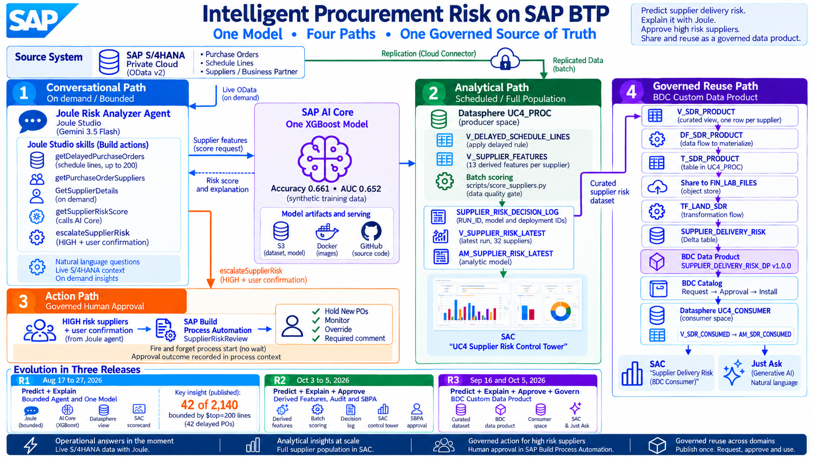

## Business problem

A procurement manager asks: which suppliers will deliver late, why, how much value is exposed, and what should be done about it? SAP's shipped Procurement Risk Analyzer Agent template only lists delayed purchase orders. This project adds prediction, explanation, reconciliation, approval, governance and reuse, built and documented in stages.

## End to end architecture

```
                          S/4HANA (Private Cloud, OData v2)
                 live OData |                          | replication (Cloud Connector)
                            v                          v
 1 CONVERSATIONAL                              2 ANALYTICAL
 Joule Risk Analyzer Agent (Gemini)            Datasphere UC4_PROC (producer)
   getDelayedPurchaseOrders                      PO header, item, schedule lines
   getPurchaseOrderSuppliers                     V_DELAYED_SCHEDULE_LINES
   GetSupplierDetails (on demand)                V_SUPPLIER_FEATURES (13 derived features)
   getSupplierRiskScore ----+                        | scoring/score_suppliers.py (batch)
   escalateSupplierRisk     |                        v
        |                   +-------------->  SAP AI Core: one XGBoost model (/v2/predict)
        | HIGH + user                                 |
        | confirmation                                v
        v                                     SUPPLIER_RISK_DECISION_LOG (RUN_ID audit)
 3 ACTION                                       |                     |
 SBPA SupplierRiskReview                        v                     v
 Hold New POs | Monitor | Override       V_SUPPLIER_RISK_LATEST   4 GOVERNED REUSE
 required comment                        AM_SUPPLIER_RISK_LATEST  V_SDR_PRODUCT -> T_SDR_PRODUCT
                                                |                   | share
                                                v                   v
                                        SAC "UC4 Supplier Risk     FIN_LAB_FILES (Object Store)
                                         Control Tower"            SUPPLIER_DELIVERY_RISK (Delta)
                                                                    |
                                                                    v
                                                  BDC data product SUPPLIER_DELIVERY_RISK_DP v1.0.0
                                                  catalog -> request -> approval -> install
                                                                    |
                                                                    v
                                                  Datasphere UC4_CONSUMER
                                                  V_SDR_CONSUMED -> AM_SDR_CONSUMED
                                                                    |
                                                                    v
                                                  SAC "Supplier Delivery Risk (BDC Consumer)" + Just Ask
```

## Build journey

The project was built in three releases. Each release closed limitations that the previous one documented honestly.

| Release | When | Scope | Closed |
|---|---|---|---|
| **R1 Bounded agent and one model** | Aug 17 to 27, 2026 | Template baseline on private S/4 (OData v4 to v2), 4 tool Joule agent, XGBoost trained and served on AI Core, Joule skill calling AI Core, Datasphere mirror and SAC scorecard, reconciliation of agent versus full population | Published: Medium article *"Your AI Agent Isn't Wrong. It's Bounded."* and LinkedIn post |
| **R2 Derived features, audit and approval** | Oct 3 to 5, 2026 | Features derived from replicated PO data, batch scorer with data quality gate, decision log, new semantic model and SAC control tower, SBPA approval, Joule escalation skill | R1 limitations: hand set features, manual batch import, no approval workflow |
| **R3 Governed data product** | Sep 16 and Oct 5, 2026 | Object Store landing, BDC custom data product, access request and approval, install into a consumer space, consumer semantic model, SAC and Just Ask | R1 deferred item: BDC deployment (Databricks not available in this environment) |

### R1: bounded agent and one model (published)

* **Joule baseline:** the SAP template targets S/4HANA Cloud Public Edition (OData v4); the private S/4 exposes v2, so the purchase order action was rebuilt on `A_PurchaseOrderScheduleLine`. Tools: `getDelayedPurchaseOrders` (delayed schedule lines, `$top=200`), `getPurchaseOrderSuppliers`, `GetSupplierDetails` (on demand enrichment), `getSupplierRiskScore`. LLM: Gemini 3.5 Flash via Generative AI Hub.
* **AI Core model:** scenario `supplier-prediction-tutorial`, resource group `default`, model artifact `d04761ba` persisted in S3, Docker images `srini117us/supplier-prediction-{train,serve}:01`. Trained on 10,000 synthetic purchase order records with 13 features; accuracy 0.661, AUC 0.652; top feature historical_ontime_rate (17 percent importance). Predict route `<deployment URL>/v2/predict`.
* **Joule to AI Core:** Build action plus Joule skill bound through destination `AICORE_INFERENCE` (Joule Studio environment variable).
* **Analytical mirror:** `V_DELAYED_AGENT_MIRROR`, `V_SUPPLIER_RISK_SCORES`, `AM_SUPPLIER_RISK_SCORES`, SAC "UC4 Supplier Scorecard".
* **Key insight, 42 of 2,140:** the agent reported 42 delayed POs across 11 suppliers; the same date filter on the full replicated population returned 2,140 POs, 34 suppliers and 10,732 schedule lines. The agent was not wrong; it was bounded by `$top=200`.
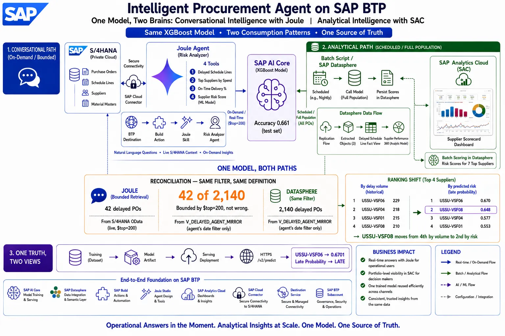

* **Ranking shift:** by delay volume USSU-VSF06, VSF04, VSF01, VSF08; by predicted risk USSU-VSF06 (0.670), VSF08 (0.648), VSF04 (0.577), VSF01 (0.553). VSF08 moved from fourth to second.

### R2: derived features, audit and approval

* **Redeploy and contract:** serving redeployed from the same configuration and artifact; an empty POST returned a 422 listing all 13 required fields. The Joule score skill was found sending only 5 of 13 fields and was fixed.
* **Derived features:** `V_SUPPLIER_FEATURES` computes per supplier features from replicated header, item and schedule line data (lead times floored at 1 day, blank supplier excluded, 32 suppliers). This replaced the hand set features that made every supplier score identically in R1.
* **Batch scoring:** `scoring/score_suppliers.py` reads features through a Datasphere database user, calls AI Core per supplier, and appends results with RUN_ID, model and deployment IDs to `UC4_PROC#SCORING.SUPPLIER_RISK_DECISION_LOG`. A data quality gate marks invalid rows SKIPPED_DQ. Latest run: 31 of 32 scored; HIGH 9, MEDIUM 10, LOW 12.
* **Semantic and SAC:** `V_SUPPLIER_RISK_LATEST` and `AM_SUPPLIER_RISK_LATEST` (average late probability divides by scored suppliers only), SAC "UC4 Supplier Risk Control Tower".
* **Approval:** SBPA `SupplierRiskReview` 1.0.1 with API trigger, approval form (Hold New POs, Monitor, Override), required comment, two day due date, published to the Library.
* **Escalation:** Joule skill `escalateSupplierRisk` (Check Condition riskBand = HIGH, Run Process without waiting, StringToNumber for probability); agent 1.0.23. When live scoring was unavailable the agent used the last valid batch score, said so, asked for confirmation and started the review.

### R3: governed data product

* **First attempt (Sep 16):** `PO_SILVER_SQL_UC4` to `T_PO_SILVER_UC4` to Delta table `PO_SILVER_UC4_DELTA`, custom data product "Purchase Order Silver UC4". Proved the DecimalFloat to Decimal cast needed by Spark. Listing stalled (KBA 3758882) and later completed.
* **Supplier Delivery Risk (Oct 5):**
  * `V_SDR_PRODUCT` curates one row per supplier from the latest run, delay metrics and features (`sql/V_SDR_PRODUCT.sql`), validated before build (`sql/validation_checks.sql`).
  * `DF_SDR_PRODUCT` materializes it to `T_SDR_PRODUCT` (only tables can be shared into an Object Store space), shared to `FIN_LAB_FILES`.
  * `TF_LAND_SDR` lands Delta table `SUPPLIER_DELIVERY_RISK` (Delete All Before Loading).
  * Data product `SUPPLIER_DELIVERY_RISK_DP` v1.0.0: Formations profile, Delta Share, Company Data, Spend Management Procurement; Lifecycle Active, Release Active, Functional Current.
  * Consumer space `UC4_CONSUMER` requested access; approved in BDC Cockpit, Governance, Access Management; agreement Current; product installed as a Delta Share view in an SAP managed space (no copy).
  * Consumer model `V_SDR_CONSUMED` and `AM_SDR_CONSUMED`, SAC story "Supplier Delivery Risk (BDC Consumer)", and Just Ask.
  * Producer and consumer reconcile exactly: 1,711 delayed lines, 532 delayed POs, 22,278,512.95 USD delayed value.

## Components

| Layer | Artifact | Release |
|---|---|---|
| Source | S/4HANA purchase order and business partner OData v2 | R1 |
| Agent | Joule project ProcurementRisk_Baseline_SAP 1.0.23, Gemini via Generative AI Hub | R1, R2 |
| Agent tools | getDelayedPurchaseOrders, getPurchaseOrderSuppliers, GetSupplierDetails, getSupplierRiskScore, escalateSupplierRisk | R1, R2 |
| ML | AI Core XGBoost, scenario supplier-prediction-tutorial, train and serve images | R1 |
| Replication | C_PURCHASEORDERDEX, C_PURCHASEORDERITEMDEX, C_PURORDSCHEDULELINEDEX | R1 |
| Delay logic | V_DELAYED_AGENT_MIRROR, V_DELAYED_SCHEDULE_LINES | R1 |
| Features | V_SUPPLIER_FEATURES (13 derived features) | R2 |
| Batch and audit | scoring/score_suppliers.py, SUPPLIER_RISK_DECISION_LOG | R2 |
| Semantic | AM_SUPPLIER_RISK_SCORES (R1), AM_SUPPLIER_RISK_LATEST (R2) | R1, R2 |
| Analytics | SAC "UC4 Supplier Scorecard" (R1), "UC4 Supplier Risk Control Tower" (R2) | R1, R2 |
| Approval | SBPA SupplierRiskReview 1.0.1 | R2 |
| Data product | V_SDR_PRODUCT, DF_SDR_PRODUCT, TF_LAND_SDR, SUPPLIER_DELIVERY_RISK_DP v1.0.0 | R3 |
| Governance | BDC Cockpit Access Management: request, approval, agreement | R3 |
| Consumer | UC4_CONSUMER: V_SDR_CONSUMED, AM_SDR_CONSUMED, SAC story, Just Ask | R3 |

## Data product schema (v1)

One row per supplier, latest scoring run only.

| Column | Type | Source |
|---|---|---|
| Supplier (key) | String(10) | decision log |
| RiskBand, Confidence, TopRiskFactor, ScoringStatus | String | decision log |
| LateProbability, OntimeProbability | Decimal(6,4) | decision log |
| DelayedLineCount, DelayedPOCount | Integer | V_DELAYED_SCHEDULE_LINES |
| DelayedPOValueUSD | Decimal(23,2) | item NetAmount, deduplicated by PO item, USD only |
| HistoricalOntimeRate, AvgLeadTimeDays | Decimal | V_SUPPLIER_FEATURES |
| ModelId, RunId, ScoredAt | String | lineage |

## Results in pictures

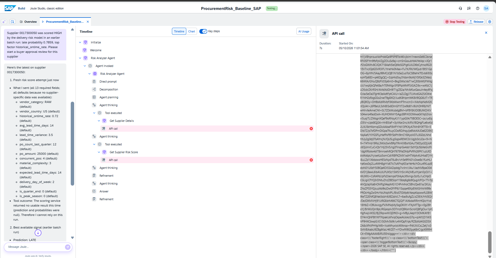
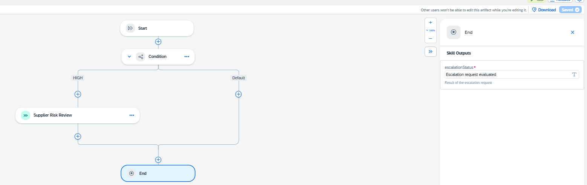
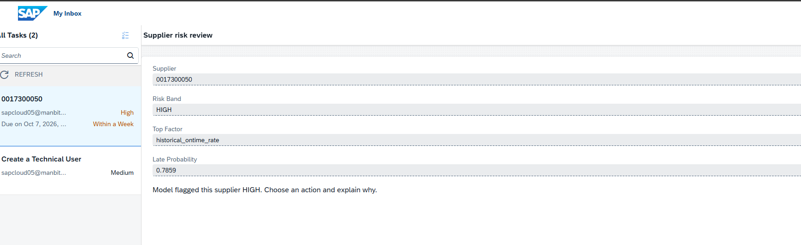
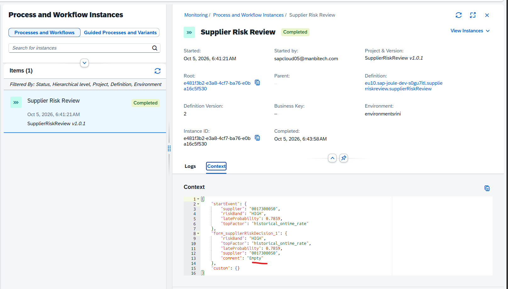
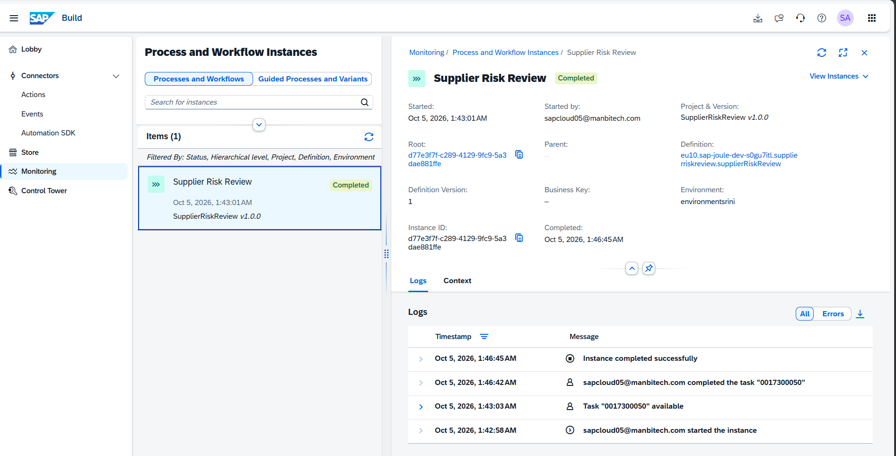
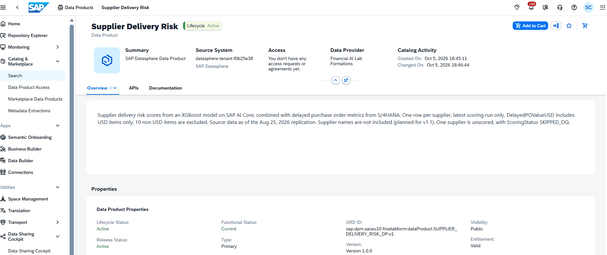
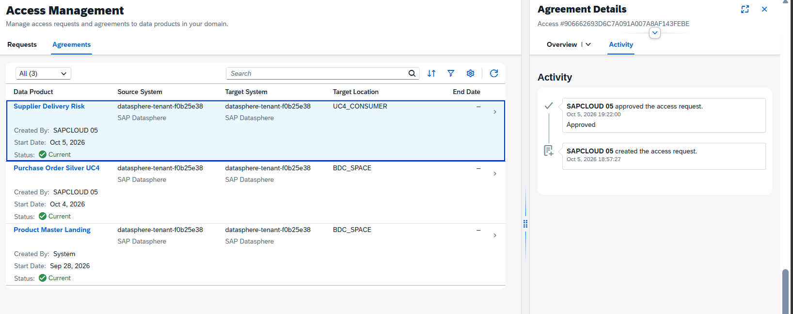
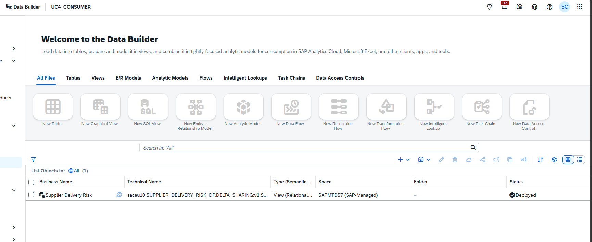
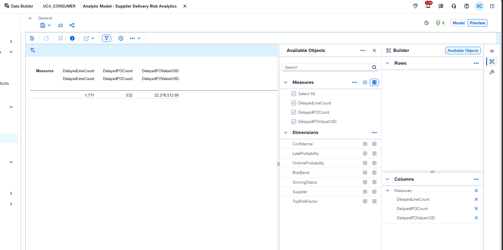
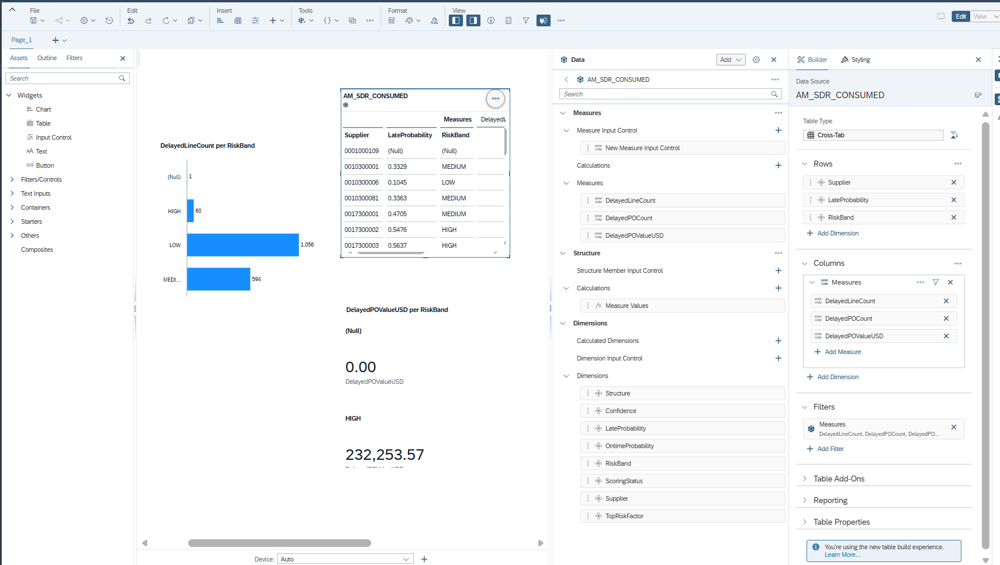
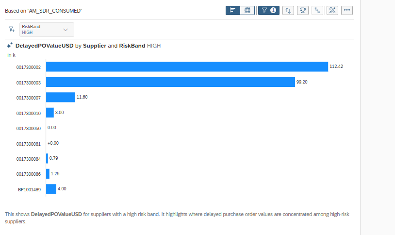

## What BDC added

The solution already worked inside Datasphere. BDC turned the curated result into a versioned, owned, discoverable product that a separate consumer requested, was approved for and installed without any access to the producer pipeline. The consumer receives a Delta Share reference rather than a copy, and the same product can later serve SAP Databricks or Snowflake members of a formation. Producer and consumer are spaces in one tenant, so this demonstrates governance, catalog and installation rather than cross system sharing.

## Findings

* **Bounded answers (R1):** a conversational answer can be correct and still operationally incomplete; the analytical mirror is how to see the bound.
* **Features decide usefulness (R1 to R2):** with hand set features every supplier scored identically; derived features produced differentiated scores from the same model and endpoint.
* **Exposure gap (R3):** the five suppliers with the largest delayed value are not HIGH risk, while all HIGH suppliers together hold about 232 thousand USD. The HIGH only approval gate misses the largest exposure.
* **Risk band versus volume (R3):** LOW suppliers carry 1,056 delayed lines, MEDIUM 594, HIGH 60. The model predicts lateness probability, not backlog volume.
* **Explanation quality (R3):** 531 of 532 delayed POs report the same top factor; top factors are global importances, so per prediction SHAP values are needed.

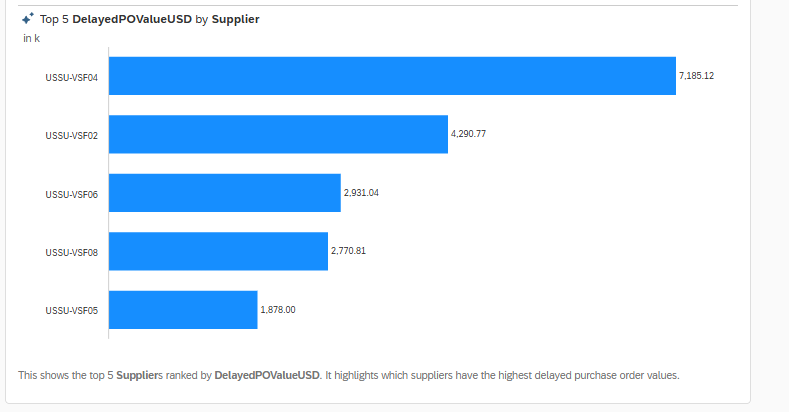

> Note on delay counts: the R1 reconciliation used the agent's date filter only (10,732 lines). R2 and R3 use the stricter open quantity rule (delivery date passed and received quantity below ordered), which gives 1,715 delayed lines.

## Design decisions

* **One model, many consumers:** the same AI Core endpoint serves the agent on demand and the batch path; no duplicated models, no drift.
* **Batch plus on demand scoring:** batch feeds analytics, audit and the data product; on demand serves the agent. The decision log keeps every run (RUN_ID).
* **Rule enforced in the skill, not only the prompt:** the HIGH check is a Check Condition step; the agent instruction adds user confirmation.
* **Fire and forget approval:** the skill does not wait for the approval outcome, which can take days.
* **Honest data:** no invented feature values or product attributes; proxies (on time rate from past due lines) are documented.
* **Snapshot product, separated domains:** the data product carries the latest run only; producer source views are not exposed for consumption, only the consumer model is.

## Known limitations

* The model is trained on synthetic data (accuracy 0.661, AUC 0.652); this shows a pipeline, not a production forecast.
* Three features are constants (vendor_country, vendor_category, delivery_day_of_week) because supplier master data is not replicated.
* The approval gate is risk band HIGH, not an exposure threshold, and the approval outcome is not persisted back to the decision log.
* The template Business Partner action expects a host only destination URL, while the purchase order actions expect the service URL; both share one destination variable.
* AI Core deployments are disposable; live scoring in Joule needs a redeploy and a destination URL update.
* The data product excludes 10 non USD delayed items and has no supplier names (planned for v1.1).
* Generative AI features in SBPA and classic Joule Studio are deprecated from January 2027.

## Lessons

**AI Core**
* AI Core is a three contracts orchestrator (registry secret, object store secret, Git and YAML); every failure is a named thing mismatch.
* A workflow template without input and output artifact bindings trains a model into the void.
* The serving configuration is deployed, not the model; treat deployments as disposable and artifacts as durable.
* An empty POST body returns a 422 listing every required field; Pydantic coerces "14" to an integer but rejects "0.5".
* Deployments bill while RUNNING, idle or not; set a TTL and end each session with none running.

**Joule and SAP Build**
* Templates may assume Public Cloud APIs; check the OData version of the target system first.
* Build from Scratch actions need output lists named after HTTP status codes (for example 200).
* Joule Studio binds destinations through project environment variables mapped at deploy time.
* OData v2 Edm.Time fields arrive as ISO 8601 durations; set API Format to None.
* Joule routes by agent description; a new tool is invisible until the description names it.
* Check Connection on BTP destinations proves reachability only, not credentials.
* Cross project process reuse: publish to the Library, then add a project dependency; changing a form invalidates every process that uses it until saved again.

**Datasphere and SAC**
* "Exposed" is not "consumable": SAC live connections need a view or analytic model, not a local table.
* CSV imports type numbers as text; CAST before a column can become a measure.
* Live Datasphere models are added in SAC through Existing Models, not the Data Source tile.
* Averages need restricted counts; SUM semantics distort KPIs.
* SQL views reject TOP (use LIMIT); pass through columns inherit source business names and keys; TO_VARCHAR without a length yields String(5000).
* Object Store targets run on Spark: cast HANA DecimalFloat to Decimal before landing.

**BDC**
* A Delta Share data product needs a Delta table in an Object Store space and a Data Provider Profile with Formations visibility; only tables can be shared into that space.
* Agreement and installation are separate steps; approvals live in BDC Cockpit under Governance, Access Management.
* A product stuck on Listing can still complete later; check Publishing Management before retrying.

**General**
* In PowerShell, single quote credentials containing `$`, `|` or `!`.
* Run a secret scan before every push; one pre commit scan caught a live AI Core client secret.

## Repository contents

* `scoring/score_suppliers.py`: batch scorer (Datasphere features to AI Core to decision log).
* `sql/V_SDR_PRODUCT.sql`: curated data product source view.
* `sql/validation_checks.sql`: column, currency, reconciliation and grain checks.
* `docs/images/`: architecture overview and curated screenshots.
* `.env.example`: variable names only; `.env` is gitignored.
* AI Core training and serving code lives in `ai-core/tutorials/supplier-prediction-tutorial/` in this repository (AI Core Git sync path).

## Run the batch scorer

```bash
pip install requests hdbcli python-dotenv
cd scoring
cp .env.example .env   # fill values
python score_suppliers.py
```

## Roadmap

* Exposure based approval gate and persisted approval outcome.
* Supplier master replication for names and the three constant features, then retrain on real history.
* Per prediction SHAP explanations.
* Data product v1.1 with SupplierName and a refresh task chain; a cross platform consumer (SAP Databricks) on a formation that includes it.

## Published

* Medium: *Your AI Agent Isn't Wrong. It's Bounded.* (Aug 27, 2026)
* LinkedIn post on the same build.

## References

* SAP Community: Custom Agentic Chatbot with SAP AI Core and Joule Studio, Part 3
* SAP samples teched2025 AI163, exercise 4 (destination environment variable pattern)
* SAP RIG: Building a Procurement Agent for S/4HANA Cloud Private Edition (baseline)

## Tech

SAP S/4HANA, SAP BTP, SAP AI Core, SAP Datasphere, SAP Business Data Cloud, SAP Analytics Cloud, SAP Build (Joule Studio, Process Automation), Python, Docker, XGBoost.
