# Email to Order: SAP + AI end to end

A working Email to Order pipeline built on a rented SAP landscape in five days:
**Google ADK (Gemini) + custom MCP server + live S/4HANA + SAP Build Process Automation**.

Send a customer PO by email to a lab mailbox → an agent reads the PDF natively
(no parser, no templates, no OCR library), validates against live S/4HANA
through governed MCP tools, routes a proposal to a human approval in SAP Build
Process Automation, posts approved orders through an idempotency guard, and
answers the sender by email.

## Architecture

```mermaid
flowchart LR
    C[Customer<br/>sends PO PDF by email] -->|1. email| M[Lab Gmail<br/>srini.orders.lab]
    M -->|2. IMAP poll| W[email_to_order.py<br/>watcher pipeline]
    W -->|3. PDF bytes| A[Gemini 3.6 flash<br/>reads PDF natively<br/>chooses tool calls]
    A -->|4. tool call over stdio| MCP[sap_mcp_server.py<br/>MCP · governed tools<br/>CSRF + idempotency guard]
    MCP -->|5. OData HTTPS :44300| S[(S/4HANA<br/>customer · material<br/>duplicate PO check)]
    S -->|JSON back| MCP
    MCP --> A
    A -->|6. proposal JSON| B[SAP Build Process Automation<br/>Order_Approval process<br/>Public environment]
    B -->|7. task in inbox| H{Human<br/>My Inbox<br/>Approve or Reject}
    H -->|8. click| D{{custom.decision<br/>PENDING → APPROVED / REJECTED}}
    D -->|APPROVED| MCP2[create_sales_order<br/>via idempotency guard]
    MCP2 --> S2[(New or existing<br/>SAP Sales Order)]
    S2 --> E[SMTP<br/>confirmation email<br/>to sender]
    D -->|REJECTED| E2[SMTP<br/>decline email<br/>to sender]

    classDef ext fill:#e0e7ff,stroke:#3730a3
    classDef mail fill:#fee2e2,stroke:#991b1b
    classDef ai fill:#dbeafe,stroke:#1e40af
    classDef sap fill:#cffafe,stroke:#0e7490
    classDef bpa fill:#dcfce7,stroke:#166534
    classDef human fill:#fef9c3,stroke:#a16207
    classDef out fill:#f5d0fe,stroke:#86198f

    class C ext
    class M,E,E2 mail
    class A ai
    class S,S2 sap
    class B,MCP,MCP2 bpa
    class H,D human
    class W ext
```

## What each file does

- `sap_mcp_server.py` — MCP server over stdio. Six governed tools: four read
  (purchase orders, one PO with items, vendor summary, classification) and
  two write (`create_sales_order` with CSRF token fetch, 120s timeout and an
  idempotency guard; `get_sales_order` read back).
- `sap_po_agent/agent.py` — Google ADK agent (Gemini 3.6 flash) with the MCP
  toolset attached (stdio, 180s timeout) and 7 instruction rules including
  invoice handling (rule 6) and customer PO approval gating (rule 7).
- `sbpa_watcher.py` — SBPA API client. Modes: `--handshake`, `--test-trigger`,
  `--watch <id>`, `--context <id>`, `--mail-test`.
- `email_to_order.py` — the assembled pipeline. Poll IMAP → agent headless
  (PDF as inline bytes) → SBPA trigger → poll decision → post on APPROVED →
  confirmation email. Modes: `--once`, `--run`.
- `debug_post.py` — isolation script to reproduce a raw POST to S/4 without
  the agent (used to diagnose blockers, kept as a troubleshooting utility).
- `sap_mcp_server_v1_readonly.py`, `sap_po_agent/agent_v1_readonly.py` —
  the initial read only version, kept for the design growth story.

## Setup

```bash
# 1. dependencies
pip install -r requirements_sap_mcp.txt
pip install google-adk

# 2. credentials
cp env.example .env
# fill in the real values in .env (SAP, Gemini, SBPA service key, Gmail app password)

# 3. one identical GOOGLE_API_KEY is also needed for adk web:
cp .env sap_po_agent/.env

# 4. sanity checks
python sbpa_watcher.py --handshake        # OAuth + 3 deployed definitions
python sbpa_watcher.py --mail-test        # IMAP login proof

# 5. run
python email_to_order.py --once           # process any unread mail with a PDF
# or, continuous:
python email_to_order.py --run
```

## Lane matrix (all proven under live traffic)

| Lane | Outcome |
|------|---------|
| Not an order (triage) | Rejected by looking at the document, zero SAP calls |
| REJECTED | Decline email to the sender |
| APPROVED + duplicate | Idempotency guard returns the existing Sales Order, no double post, confirmation cites the existing order |
| APPROVED + new | New Sales Order created, confirmation sent |

## SBPA project

The approval workflow used by the pipeline is exported as `OrderApproval_EmailtoOrder_GCP.mtar`.  
To reproduce: SAP Build lobby → three dots menu → Import Project → select the .mtar file → Release → Deploy to your Public environment. The pipeline expects a process named `Order_Approval` inside project `OrderApproval_EmailtoOrder_GCP` with an API trigger named `orderProposal`; the deployed `SBPA_DEFINITION_ID` in `.env` needs updating to your tenant's version.

## Notes

- Test data is synthetic (customer POs, invoice kit generated from real S/4
  master data on a rented lab landscape). No production data is in this repo.
- Every credential lives in `.env` (git ignored); `env.example` is the
  blueprint. Rotate any secret that has ever been on a shared screen.
- For demo day: put the Gemini API key on billing (paid tier gets priority
  during capacity spikes) or route through Vertex AI.

