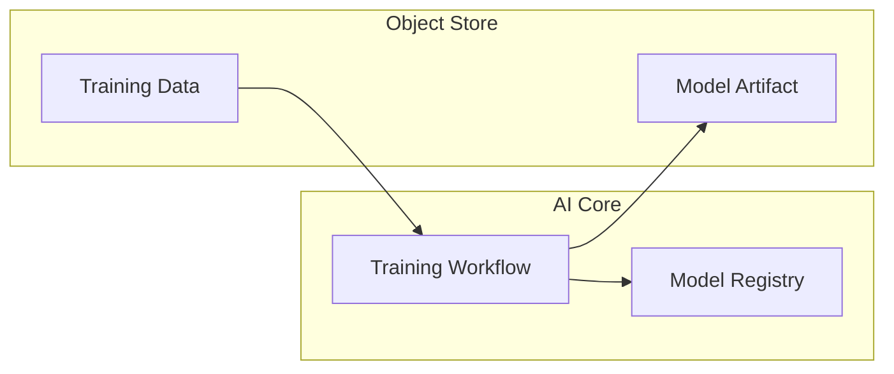

# ML Training Pipeline

Full ML training workflow on SAP AI Core with data loading, training, and model output.

## Architecture



## Structure

```
ml-training-pipeline/
└── workflows/
    └── ml-training.yaml
```

## Pipeline Steps

| Step | Input | Output |
|------|-------|--------|
| Load | S3 path | raw.csv |
| Preprocess | raw.csv | cleaned.csv |
| Train | cleaned.csv | model.pkl |
| Register | model.pkl | Model artifact |

## Training Code Pattern

```python
import boto3
import pickle
from sklearn.ensemble import RandomForestClassifier

# Load from object store
s3 = boto3.client('s3')
s3.download_file(bucket, 'train.csv', '/tmp/train.csv')

# Train
model = RandomForestClassifier()
model.fit(X_train, y_train)

# Save to object store
with open('/tmp/model.pkl', 'wb') as f:
    pickle.dump(model, f)
s3.upload_file('/tmp/model.pkl', bucket, 'models/model.pkl')
```

## Configuration Parameters

| Parameter | Description |
|-----------|-------------|
| `data_path` | S3 path to training data |
| `model_output` | S3 path for model artifact |
| `epochs` | Training iterations |

## References

- [AI Core Training](https://help.sap.com/docs/sap-ai-core/sap-ai-core-service-guide/train-model)
- [Object Store Integration](https://help.sap.com/docs/sap-ai-core/sap-ai-core-service-guide/object-store)
