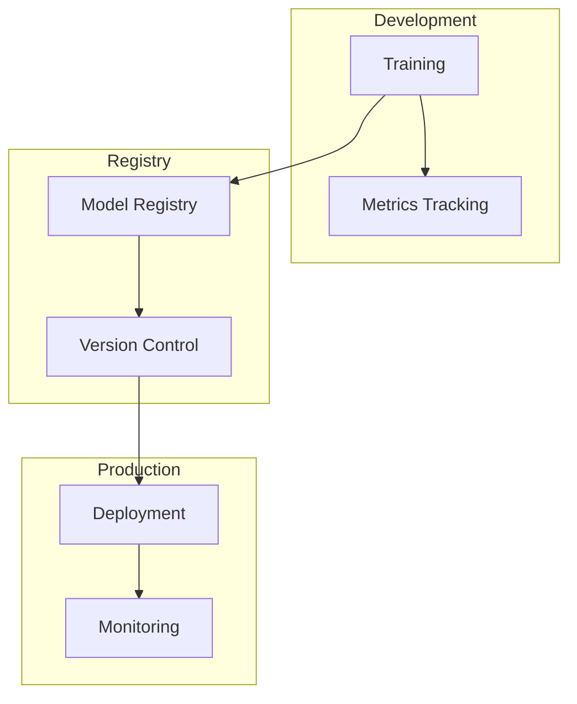

# MLOps

MLOps patterns for SAP AI Core including experiment tracking, model versioning, and CI/CD.

## Architecture



## Structure

```
mlops/
└── lab-aicore-metrics/
    └── ...
```

## Experiment Tracking

```python
from ai_core_sdk.tracking import Tracking

tracking = Tracking()

# Log hyperparameters
tracking.set_tags({
    "model_type": "xgboost",
    "learning_rate": 0.1
})

# Log metrics per epoch
for epoch in range(100):
    tracking.log_metrics({
        "loss": loss,
        "accuracy": accuracy
    }, step=epoch)
```

## Model Versioning

```
models/
├── v1.0.0/model.pkl
├── v1.1.0/model.pkl
└── v2.0.0/model.pkl
```

## CI/CD Integration

```yaml
# GitHub Actions
on:
  push:
    branches: [main]
jobs:
  train:
    steps:
      - name: Trigger AI Core
        run: |
          curl -X POST $AI_CORE_API/executions \
            -H "Authorization: Bearer $TOKEN" \
            -d '{"configuration_id": "$CONFIG_ID"}'
```

## Key Metrics

| Metric | Description |
|--------|-------------|
| Training loss | Model convergence |
| Validation accuracy | Generalization |
| Inference latency | Production performance |
| Model size | Resource requirements |

## Best Practices

| Practice | Implementation |
|----------|----------------|
| Version control | Git for code, S3 for data |
| Track metrics | AI Core SDK |
| Automate tests | CI pipeline |
| Monitor drift | Production alerts |

## References

- [AI Core MLOps](https://help.sap.com/docs/sap-ai-core/sap-ai-core-service-guide/mlops)
- [AI Core SDK](https://pypi.org/project/ai-core-sdk/)
